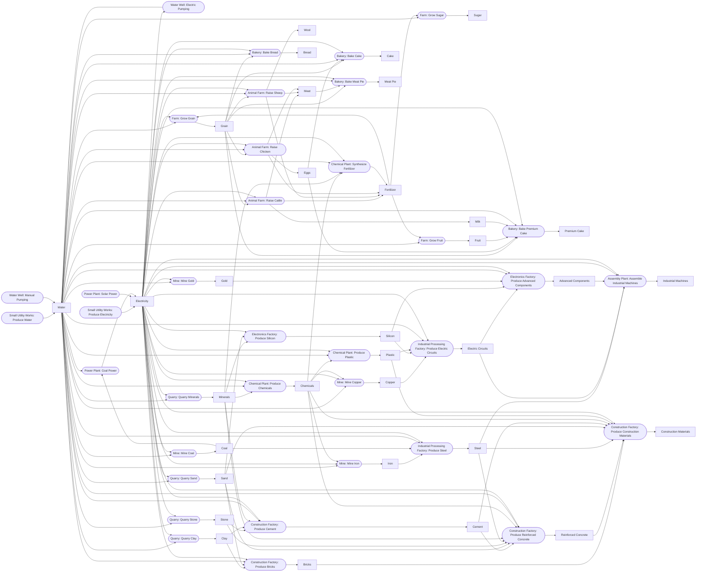
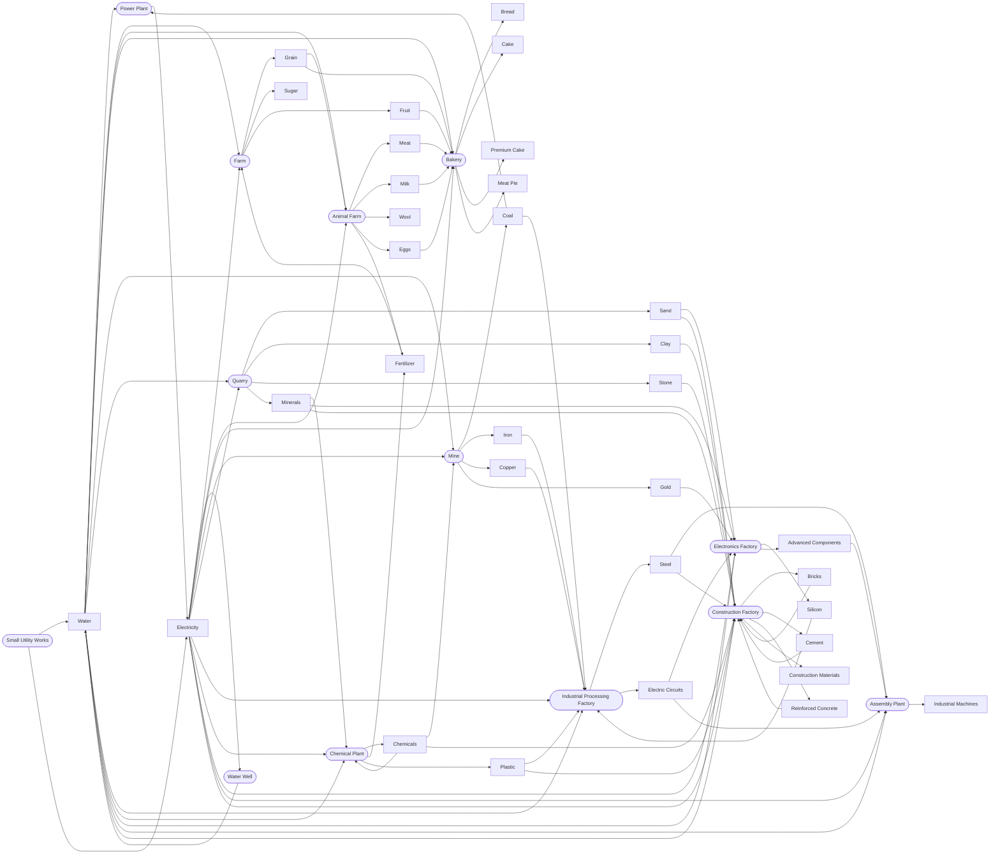

# Industri Clicker Variable Relationship Map

This is the authority for concrete variables, dependencies, commands, time effects, and persistence. Names are in [CONTEXT.md](CONTEXT.md); rules/formulas are in [gameflow.md](gameflow.md). Tables are the compact index; Mermaid diagrams visualize the same relationships without replacing exact recipe values.

## Resource Production Map

`game/resources/resourceConstants.ts` owns resource identities/market seeds; `game/recipes/recipeConstants.ts` owns exact recipe values.

| Resource | Produced by | Inputs per cycle |
|---|---|---|
| Water | Small Utility Works: Produce Water; Water Well: Manual / Electric Pumping | None / None / 1 Electricity |
| Electricity | Small Utility Works: Produce Electricity; Power Plant: Coal / Solar Power | None / 0.5 Coal + 1 Water / None |
| Grain | Farm: Grow Grain | 1 Water, 1 Electricity, 0.025 Fertilizer |
| Sugar | Farm: Grow Sugar | 3 Water, 0.04 Fertilizer |
| Fruit | Farm: Grow Fruit | 2 Water, 0.03 Fertilizer |
| Meat | Animal Farm: Raise Cattle / Sheep / Chicken | 3 / 2 / 1 Grain, 2 / 1.5 / 1 Water, 1.25 / 1 / 0.75 Electricity |
| Milk | Animal Farm: Raise Cattle | 3 Grain, 2 Water, 1.25 Electricity |
| Wool | Animal Farm: Raise Sheep | 2 Grain, 1.5 Water, 1 Electricity |
| Eggs | Animal Farm: Raise Chicken | 1 Grain, 1 Water, 0.75 Electricity |
| Bread | Bakery: Bake Bread | 1.5 Grain, 1 Water, 1 Electricity |
| Cake | Bakery: Bake Cake | 1 Grain, 0.5 Eggs, 2 Water, 2 Electricity |
| Premium Cake | Bakery: Bake Premium Cake | 1 Grain, 0.5 Eggs, 1 Fruit, 1 Milk, 2 Water, 2 Electricity |
| Meat Pie | Bakery: Bake Meat Pie | 1 Grain, 1 Meat, 1 Water, 2 Electricity |
| Coal | Mine: Mine Coal | 1 Water, 2 Electricity |
| Iron | Mine: Mine Iron | 2 Water, 4 Electricity, 0.1 Chemicals |
| Copper | Mine: Mine Copper | 2 Water, 5 Electricity, 0.1 Chemicals |
| Gold | Mine: Mine Gold | 3 Water, 8 Electricity |
| Sand | Quarry: Quarry Sand | 1 Water, 1 Electricity |
| Clay | Quarry: Quarry Clay | 2 Water, 1 Electricity |
| Stone | Quarry: Quarry Stone | 1 Water, 4 Electricity |
| Minerals | Quarry: Quarry Minerals | 1 Water, 2 Electricity |
| Steel | Industrial Processing Factory: Produce Steel | 2 Iron, 1 Coal, 2 Water, 6 Electricity |
| Electric Circuits | Industrial Processing Factory: Produce Electric Circuits | 2 Copper, 1 Silicon, 1 Plastic, 1 Water, 4 Electricity |
| Chemicals | Chemical Plant: Produce Chemicals | 2 Minerals, 2 Water, 4 Electricity |
| Fertilizer | Chemical Plant: Synthesize Fertilizer; Animal Farm: Raise Cattle / Sheep / Chicken | 1 Chemicals, 1 Minerals, 1 Water, 2 Electricity / animal inputs |
| Plastic | Chemical Plant: Produce Plastic | 2 Chemicals, 1 Water, 3 Electricity |
| Silicon | Electronics Factory: Produce Silicon | 3 Minerals, 3 Sand, 5 Electricity |
| Advanced Components | Electronics Factory: Produce Advanced Components | 2 Electric Circuits, 2 Silicon, 0.1 Gold, 1 Water, 4 Electricity |
| Industrial Machines | Assembly Plant: Assemble Industrial Machines | 6 Steel, 3 Electric Circuits, 2 Advanced Components, 2 Water, 6 Electricity |
| Bricks | Construction Factory: Produce Bricks | 2 Clay, 1 Sand, 1 Water, 3 Electricity |
| Cement | Construction Factory: Produce Cement | 3 Stone, 1 Clay, 1 Minerals, 1 Water, 5 Electricity |
| Reinforced Concrete | Construction Factory: Produce Reinforced Concrete | 2 Cement, 3 Sand, 2 Stone, 2 Steel, 0.5 Minerals, 0.25 Chemicals, 2 Water, 2 Electricity |
| Construction Materials | Construction Factory: Produce Construction Materials | 2 Bricks, 1 Reinforced Concrete, 1 Steel, 1 Sand, 1 Cement, 0.1 Chemicals, 0.2 Plastic, 2 Electricity |

## Facility Resource Flow Map

| Facility | Consumes | Produces |
|---|---|---|
| Farm | Water, Electricity, Fertilizer | Grain, Sugar, Fruit |
| Animal Farm | Grain, Water, Electricity | Meat, Milk, Wool, Eggs, Fertilizer |
| Bakery | Grain, Eggs, Fruit, Milk, Meat, Water, Electricity | Bread, Cake, Premium Cake, Meat Pie |
| Small Utility Works | None | Water, Electricity |
| Water Well | Electricity (electric mode) | Water |
| Power Plant | Coal and Water (coal mode) | Electricity |
| Mine | Water, Electricity, Chemicals | Coal, Iron, Copper, Gold |
| Quarry | Water, Electricity | Sand, Clay, Stone, Minerals |
| Industrial Processing Factory | Iron, Coal, Copper, Silicon, Plastic, Water, Electricity | Steel, Electric Circuits |
| Chemical Plant | Minerals, Water, Electricity, Chemicals | Chemicals, Fertilizer, Plastic |
| Electronics Factory | Minerals, Sand, Electric Circuits, Gold, Water, Electricity | Silicon, Advanced Components |
| Assembly Plant | Steel, Electric Circuits, Advanced Components, Water, Electricity | Industrial Machines |
| Construction Factory | Clay, Sand, Stone, Steel, Minerals, Chemicals, Plastic, Water, Electricity, Bricks, Cement, Reinforced Concrete | Bricks, Cement, Reinforced Concrete, Construction Materials |

## Stored and Runtime State

| State | Owner | Changes through | Saved as |
|---|---|---|---|
| `inventory.entries.*.quantity/.quality/.sourceCostPerUnit` | Inventory | Resource commands and production additions/removals | `InventorySnapshot` |
| `facility.recipeInputQ/.recipeInputSourceCost` | Facility | Captured at cycle input consumption; used at completion | Facility snapshot; production-maintenance allocation is added to output source cost |
| Facility upgrade levels, workers, staff wage, condition, auto-repair settings | Facility | Upgrade, staffing/wage, repair, and foreground wear | Facility snapshot |
| Resource-flow buckets and lifetime facility output | ResourceFlowLedger | Inventory-affecting commands and completed output | Game snapshot |
| Finance balance, transactions, loans, lenders, searches, economy phase, staff-wage charges | Finance | Cash commands and foreground finance rules | `FinanceSnapshot` |
| Numbered facilities, recipe order/position/progress, maintenance statistics | FacilityCollection | Construction, cycle setup, upgrades, production, repair | Facility snapshot |
| Offered/completed orders, customer states, next order number | SalesOrders | Create, fulfil, reject, expire, relationship progression | `SalesOrdersSnapshot` |
| Achievements, prestige events, research/grants | Their ledgers | Post-command evaluation and research commands | Their snapshots |
| Market pools, automation, depth multiplier, network activations | Market | Trades, order fulfilment, diffusion, activations | `MarketSnapshot` |
| Logical game time, partial work, customer pipeline | Game store | Company lifecycle and foreground advance | `GameTimeSnapshot` |
| Profile, company, session, tutorial metadata | SQLite adapters | Local identity and tutorial commands | Dedicated local tables |
| Wall-clock observation anchor and UI data | Runtime helpers | App lifecycle and selectors | Not persisted |

Derived values include facility efficiency/output, worker/wage efficiency, production-maintenance allocation, quality ceilings, order cap/rate/selection weights, prestige, market diffusion, market activation progress, research capacity, credit limits, statements, and UI view models.

## Command Effects

| Command/group | Reads | Writes |
|---|---|---|
| Inventory and market trades | Resource, amount, market quote, quality | Inventory, market, Finance, Resource Flow |
| Construction/material purchase | Facility definition, prices, supply, balance | Facilities, market, inventory, Finance |
| Facility commands | Definition, research, inputs, balance, facility state, staff wage | Facility collection, inventory, Finance, Resource Flow |
| Finance commands | Loan/search criteria, lender policies, credit report, active loan | Finance, prestige, achievements |
| Research commands | Catalogue, gates, grants, Finance, research ledger | Research, grants, Finance, prestige, achievements |
| `advanceRealtime` / `advanceGameTime` | Time anchors and all timed state | Time, facilities, staff wages, markets, orders, research, loans, Finance, flow |
| Completed production | Recipe, upgrades, input Q/source cost, production-maintenance allocation, lifetime output | Inventory, flow, Finance performance, achievements |
| Sales commands | Order, inventory, market, current time | Orders, relationships, inventory, global market, Finance, prestige, flow |
| Achievement evaluation | Post-command domain state | Unlocks and idempotent prestige events |
| Company/session commands | Profile/company records and snapshots | SQLite session, company save, runtime state |

UI issues commands; it does not mutate domain state directly.

## Persistence Mapping

| State group | Durable representation | Restore |
|---|---|---|
| Gameplay ledgers and domain state | Company-keyed current `GameSnapshot` | Valid active-company snapshot; invalid current saves are discarded |
| Logical time and pipeline | `GameTimeSnapshot` | Restore time/pipeline; reset observation anchor |
| Profile/company/session/tutorial metadata | Dedicated SQLite tables | Load before activating a company |
| Catalogues and balance values | Typed code constants | Reload from app version; never save |

Normal changes batch saves; background/checkpoints flush after final foreground processing. There is no compatibility migration layer.
