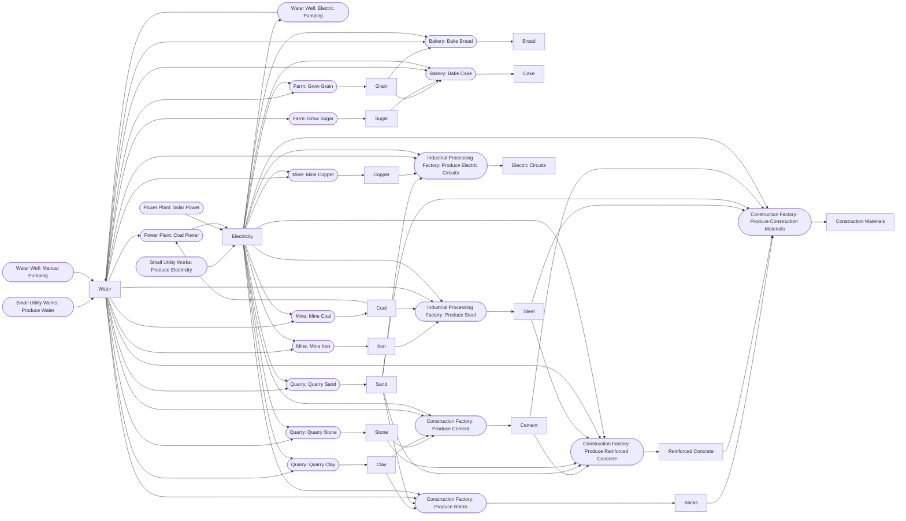
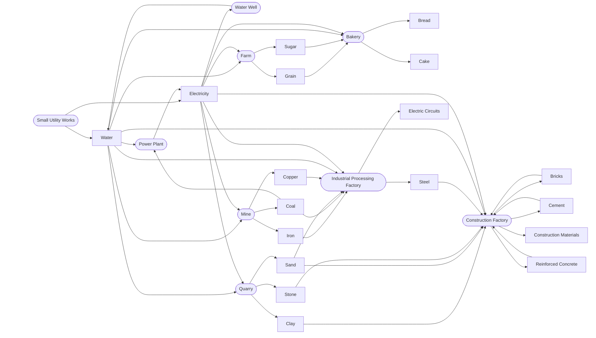

# Industri Clicker Variable Relationship Map

Concrete data relationships for rules defined in [gameflow.md](gameflow.md). This map owns variable-level state and command effects, not player rationale or full formulas.

## Resource Production Map

The catalogue in `game/resources/resourceConstants.ts` is the source of truth for resource identities and market seeds; `game/recipes/recipeConstants.ts` owns the exact recipes. The table is a compact index of every current output. The diagram shows every direct production dependency; resources with no outgoing arrows have no current recipe consumer.

| Resource | Produced by | Inputs per cycle |
|---|---|---|
| Water | Small Utility Works: Produce Water; Water Well: Manual / Electric Pumping | None / None / 1 Electricity |
| Electricity | Small Utility Works: Produce Electricity; Power Plant: Coal / Solar Power | None / 1 Coal, 2 Water / None |
| Grain | Farm: Grow Grain | 1 Water, 1 Electricity |
| Sugar | Farm: Grow Sugar | 4 Water |
| Bread | Bakery: Bake Bread | 2 Grain, 1 Water, 1 Electricity |
| Cake | Bakery: Bake Cake | 1 Grain, 0.5 Sugar, 2 Water, 2 Electricity |
| Coal | Mine: Mine Coal | 1 Water, 2 Electricity |
| Iron | Mine: Mine Iron | 2 Water, 4 Electricity |
| Copper | Mine: Mine Copper | 2 Water, 5 Electricity |
| Sand | Quarry: Quarry Sand | 1 Water, 1 Electricity |
| Clay | Quarry: Quarry Clay | 2 Water, 1 Electricity |
| Stone | Quarry: Quarry Stone | 1 Water, 4 Electricity |
| Steel | Industrial Processing Factory: Produce Steel | 2 Iron, 1 Coal, 2 Water, 6 Electricity |
| Electric Circuits | Industrial Processing Factory: Produce Electric Circuits | 2 Sand, 2 Copper, 1 Water, 4 Electricity |
| Bricks | Construction Factory: Produce Bricks | 2 Clay, 1 Sand, 1 Water, 3 Electricity |
| Cement | Construction Factory: Produce Cement | 3 Stone, 1 Clay, 1 Water, 5 Electricity |
| Reinforced Concrete | Construction Factory: Produce Reinforced Concrete | 2 Cement, 3 Sand, 2 Stone, 2 Steel, 2 Water, 2 Electricity |
| Construction Materials | Construction Factory: Produce Construction Materials | 4 Bricks, 2 Reinforced Concrete, 2 Steel, 2 Sand, 2 Cement, 3 Electricity |

## Facility Resource Flow Map

This view uses the same resource-flow model as the recipe diagram, but each facility is represented once even when it has several recipes. Resource arrows therefore show all resources a facility can consume or produce; several Construction Factory resources form intentional within-facility loops.

## Stored and Runtime State

| State | Kind | Owner | Changes through | Saved as |
|---|---|---|---|---|
| `inventory.entries.*.quantity`, `.quality` | Stored | `Inventory` | Resource commands and production | `InventorySnapshot` |
| `finance.balance`, `.transactions` | Stored | `Finance` | Accepted transactions | `FinanceSnapshot` |
| Numbered facility instances and recipe progress | Stored | `FacilityCollection` | Construction, setup, upgrades, and production | Facility snapshot |
| Facility upgrade levels, assigned workers, and 0–1 condition | Stored | `Facility` | Upgrade/staffing commands and foreground wear/production tear | Facility snapshot |
| `salesContracts.offered`, `.completed`, `.nextCustomerNumber` | Stored | `SalesContracts` | Offers and contract actions | `SalesContractsSnapshot` |
| `achievements.unlocks` | Stored | `AchievementLedger` | Post-command achievement evaluation | `AchievementLedgerSnapshot` |
| `productionStatistics.producedByResource` | Stored | `ProductionStatistics` | Completed facility recipe output only | `ProductionStatisticsSnapshot` |
| `prestige.events` | Stored | `PrestigeLedger` | Balance changes and fulfilled sales | `PrestigeLedgerSnapshot` |
| `research.completed`, `.active` | Stored | `ResearchLedger` | Research start, foreground advance, completion, cancellation | `ResearchLedgerSnapshot` |
| `grants.grants` | Stored | `GrantLedger` | First facility construction and free-action consumption | `GrantLedgerSnapshot` |
| `startingConditionId` | Runtime | Zustand game store | Company activation/session change | No; source is the local company record |
| `companyStartedAtGameTimeMs`, `lastProcessedAtMs`, `unprocessedWorkMs`, `customerPipelineProgress` | Stored | Zustand game store | Company creation, deletion, and global time advance | `GameTimeSnapshot` |
| `lastObservedAtMs` | Runtime | Zustand game store | Foreground observation and lifecycle | No |
| Local profile, company record, tutorial state, device session | Stored | Company domain SQLite adapters | Local player/company commands | Dedicated local tables |

Derived values include facility efficiency, production work/output, contract reward and offer chance, current prestige, market diffusion amount, and UI view models.

## Command Effects

| Command | Reads | Writes |
|---|---|---|
| `setInventoryAmount` | Resource and amount | Inventory |
| `buyMissingConstructionMaterials` | Facility definition; local Construction Materials price/supply; balance; inventory | Market; Finance; Inventory |
| `buildFacility`, `destroyFacility`, `repairFacility`, `setFacilityRecipe`, `setFacilityWorkers`, `upgradeFacility` | Facility definition; balance and Construction Materials where applicable | Facilities; Finance; Inventory where applicable |
| `advanceRealtime`, `advanceGameTime`, `fastForwardOneMinute` | Time anchors and all timed state | Game time, pipeline, facility condition, inventory, sales contracts, active research |
| Completed production output | Facility output and output multiplier | Production statistics; production achievements |
| `fulfillSalesContract`, `rejectSalesContract` | Contract; inventory and finance where applicable | Sales contracts; inventory and finance where applicable |
| Achievement evaluation | Post-command domain state | Achievement unlocks; idempotent achievement prestige events |
| `getResearchAvailability`, `startResearch`, `cancelResearch` | Code catalogue, pure gate context, finance, research ledger, progression grants | Research; grant use; finance/prestige and relevant achievements |
| `createSalesContractRequest` | Selected resource, quantity, derived capacity | Sales contracts and pipeline |
| `activateCompany` | Selected profile, outgoing snapshot, requested company snapshot | Device session; complete runtime game state |
| `deleteActiveCompany` | Active company ID | Removes the active company and returns to local company selection |
| `clearAllLocalData` | All local records | Clears profiles, companies, saves, tutorials, and the device session |

All normal state changes batch persistence; background and explicit checkpoints flush it. UI issues commands and does not mutate state directly.

## Persistence Mapping

| State group | Save representation | Restore |
|---|---|---|
| Inventory, finance, facilities, sales contracts, achievements, production statistics, prestige, research, progression grants | Respective snapshot inside a company-keyed `GameSnapshot` | Restore the active company's valid current-version snapshot |
| Foreground game time and pipeline | `GameTimeSnapshot` | Restore logical/partial time and pipeline; reset observation anchor |
| Catalogues and balance configuration | Typed code definitions | Reload from the app version; never save |
| Player/company/session/tutorial metadata | Dedicated company-domain SQLite records | Load before an active company runtime session begins |
