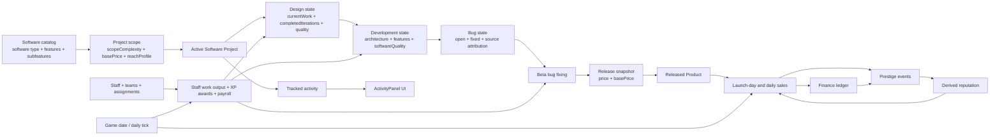
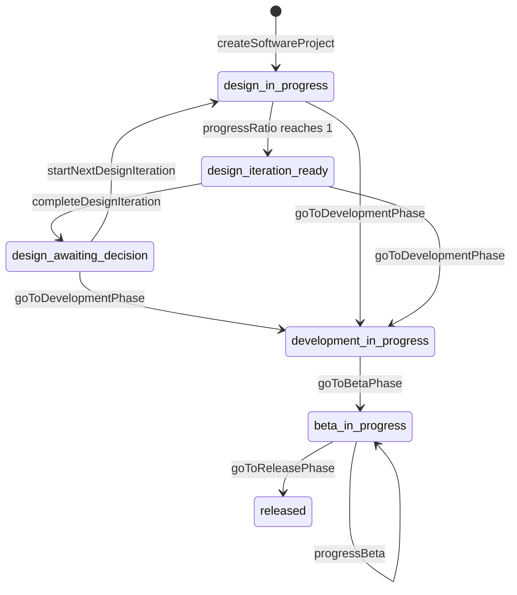

# Office Tycoon Gameflow And Variable Relationship Map

Date: 2026-06-21
Status: Current implemented systems only

This is the canonical mechanics-flow document for the current prototype.
Variable relationships, state ownership, formulas, and persistence notes live here as one maintained reference.

Use nearby docs like this:

- `docs/WorkingDocs/CONTEXT.md` - canonical domain vocabulary
- `docs/WorkingDocs/gameflow.md` - canonical variable relationships, formulas, and state ownership
- `docs/WorkingDocs/PROJECT_INFO.md` - implementation status, repo map, routes, and commands
- `docs/WorkingDocs/design.md` - stable design direction and architecture intent

## Current App Surfaces

The current browser shell includes:

- `/` - `CompanyPage` placeholder
- `/production` - `ManageProductionPage` for creating and inspecting all current projects
- `/staff` - implemented staff management page
- `/finance` - implemented finance page
- `/market` - `MarketPage` placeholder
- `/officepedia` - `OfficepediaPage` placeholder
- `/debug` - deeper mechanic inspection/debug route
- `/admin` - local-save inspection/reset route

The shell also includes:

- `TopNavigation` with main nav, dev nav, date, cash, reputation, and advance-day action
- `ActivityPanel` backed by persisted activity state for all current staff-assignable work

## Source Files

- `src/constants/softwareCatalog.ts` - software types, features, subfeatures, complexity, base prices, and per-software reach profiles
- `src/constants/designBalance.ts` - design balance constants
- `src/constants/developmentBalance.ts` - development balance constants
- `src/constants/betaBalance.ts` - bug chance and beta bug-fixing constants
- `src/constants/reachBalance.ts` - market growth, awareness, quality, scope, and price multipliers
- `src/constants/reputationBalance.ts` - prestige decay, reputation normalization, and prestige balance constants
- `src/constants/staffBalance.ts` - XP, wage, capacity, team-scaling, and specialization-fit constants
- `src/constants/staffCatalog.ts` - staff skill and specialization definitions
- `src/constants/timeBalance.ts` - month sequence, starting date, week length, month length, year length, and default tick work
- `src/engine/product/catalogLookup.ts` - validates selected catalog IDs and calculates scope complexity
- `src/engine/product/designEngine.ts` - creates projects and progresses design iterations
- `src/engine/product/developmentEngine.ts` - enters development, progresses development work, calculates software quality, and creates source-attributed bugs
- `src/engine/product/bugEngine.ts` - creates and fixes bugs
- `src/engine/product/betaEngine.ts` - enters beta and progresses beta bug fixing
- `src/engine/product/releaseEngine.ts` - enters release and captures price/base-price state
- `src/engine/market/reachEngine.ts` - calculates addressable market, awareness, age decay, launch-day sales, and daily product sales
- `src/engine/prestige/reputationEngine.ts` - calculates prestige, reputation, and prestige event inputs
- `src/engine/staff/staffEngine.ts` - calculates effective skill, work output, XP awards, and payroll
- `src/engine/core/gameTick.ts` - advances the calendar and applies phase-appropriate project work
- `src/engine/activity/activityEngine.ts` - derives player-facing activity records from project phase state
- `src/engine/economy/financeStatements.ts` - derives statements and grouped cashflow views from finance transactions
- `src/stores/timeStore.ts` - persists the current `GameDate`
- `src/stores/financeStore.ts` - persists cash balance and finance transactions
- `src/stores/prestigeStore.ts` - persists prestige events
- `src/stores/staffStore.ts` - persists staff, teams, XP, and payroll actions
- `src/stores/productionStore.ts` - persists the project list, per-project draft release prices, and project lifecycle actions
- `src/stores/activityStore.ts` - persists the activity list and per-activity staff/team assignments for the sidebar panel
- `src/stores/releasedProductStore.ts` - persists released products, cumulative sales, and recent sales history
- `src/ui/hooks/useGameTick.ts` - wraps the pure tick with prestige decay, finance sync, XP application, activity sync, and released-product sales
- `src/ui/hooks/useAdvanceDay.ts` - calculates assigned staff output and advances the day
- `src/utils/numberUtils.ts` - safe numeric helpers, clamping, currency rounding, and unit rounding
- `src/utils/calc.ts` - diminishing-return, asymmetrical multiplier, and prestige-to-reputation curves

## Core Relationship Loop

## Relationship Invariants

- Use **Software Project** for the lifecycle entity. Do not import winery, factory, or generic production terminology into Office Tycoon docs.
- Design quality modifies development speed; it does not directly create revenue or prestige.
- Bugs are created during development, reduce quality until fixed, and remain part of the release snapshot.
- A release creates a persisted **Released Product**. Ongoing sales come from the released-product store, not from mutating the release phase directly.
- Reputation is always derived from prestige events. It is never persisted as a separate source of truth.
- Staff payroll is a finance flow, not a project-quality flow. It changes cash and finance-derived prestige, not quality directly.
- Activity tracking is the player-facing staff-work surface. Software Project Activities mirror project phase and progress, while future non-project Activities can use the same assignment model.

## Ownership Map

### Product Scope And Lifecycle

| Variable / state | Produced by | Main consumers | Notes |
|---|---|---|---|
| `softwareTypeId`, `featureIds`, `subfeatureIds` | UI selection + `resolveSelection()` | project creation, scope complexity, release pricing, reach tuning | Selection must match `SOFTWARE_CATALOG`. |
| `scopeComplexity` | `resolveSelection()` | design work, feature work, reach scope multiplier, release prestige | Sum of software type, feature, and subfeature complexity. |
| `projects` | `useProductionStore` | production UI, tick flow, activity store, staffing profile, release flow | Persisted in `officetycoon-production`; multiple projects can run at the same time. |
| `design.currentWork`, `design.progressRatio`, `design.completedIterations`, `design.quality` | `progressDesign()` and `completeDesignIteration()` | development entry, activity sync, production UI | Design quality is a speed modifier, not a stored market stat. |
| `development.architecture`, `development.features`, `development.softwareQuality` | `goToDevelopmentPhase()`, `progressDevelopment()`, `recalculateDevelopmentQuality()` | beta entry, release snapshot, reach, release prestige, production UI | Software quality is derived from architecture + feature score, then reduced by open bugs. |
| `bugs.items`, `bugs.open`, `bugs.fixed`, `bugs.created` | `addDevelopmentBugs()` and `fixOpenBugs()` | development penalties, beta progress, release snapshot, release prestige, activity sync | Bugs stay source-attributed to architecture or a feature. |
| `beta.fixProgress` | `progressBeta()` | beta UI and bug-fix carryover | Stored leftover work toward the next bug fix. |
| `release.price`, `release.basePrice` | `goToReleasePhase()` | released product snapshot, price multiplier, finance diagnostics | Release captures price state only. |
| `ReleasedProduct` | `buildReleasedProductFromProject()` | daily sales, finance revenue, prestige, market diagnostics | This becomes the source of post-release sales. |

### Staff, Time, And Activity

| Variable / state | Produced by | Main consumers | Notes |
|---|---|---|---|
| `staff`, `teams` | `useStaffStore` | work output, payroll, staff UI | Persisted in `officetycoon-staff`; staff/team assignment lives on each Activity. |
| `StaffWorkProfile` | `buildProjectStaffWorkProfile(project)` | work output and XP awards | Phase-specific weighting: design, development, beta, or release. |
| `Activity.assignedStaffIds`, `Activity.assignedTeamIds` | `useActivityStore.setActivityStaffing()` | staff work output, staff UI, activity panel | Staff assigned to multiple Activities split individual contribution across those Activities. |
| `weightedEffectiveSkill` and `specializationFit` | `staffEngine` | individual contribution | XP fills the remaining gap toward mastery. |
| `totalWork` | `calculateStaffWorkOutput()` | `processGameTick()` | Team output is sublinear through `teamSizeExponent`. |
| `xpAwards` | `processGameTick()` | `useStaffStore.awardStaffExperience()` | Only awarded when the tick actually progressed a project. |
| `payroll` | `calculatePayroll()` | finance ledger | Processed on every day advance when active staff exist. |
| `GameDate` | `createInitialGameDate()` and `advanceGameDate()` | tick flow, daily sales, prestige timestamps, period filters | Persisted in `officetycoon-time`. |
| `activities` | `createActivityForProject()` and `syncActivityProgress()` | `ActivityPanel`, `StaffAssignmentModal`, day advance | Persisted in `officetycoon-activity` as the staff-assignable work list. |
| tick events | `processGameTick()` | UI feedback, activity sync | Release phase advances time but does not add recurring project work. |

### Sales, Finance, Prestige, And Reputation

| Variable / state | Produced by | Main consumers | Notes |
|---|---|---|---|
| launch-day sales | `useProductionStore.release()` -> `calculateDailyProductSales()` | released-product totals, finance, prestige | Happens immediately when a project is released. |
| daily sales | `useGameTick()` -> `processDailySalesForAllProducts()` | released-product totals, finance, prestige, diagnostics | Skips products already processed for the same game day. |
| `finance.balance` and `finance.transactions` | `useFinanceStore` | finance page, company-finance prestige, admin reset | Starting cash is `100_000`. |
| `product_sales` transaction | positive released-product revenue | income statement, cashflow, retained earnings | Free products may sell units without creating revenue transactions. |
| `staff_wages` transaction | payroll processing | expenses, cashflow, retained earnings | Recorded even if there is no project progress that day. |
| `prestigeEvents` | release prestige, product-sales prestige, company-finance sync | reputation, prestige modal, market awareness | Persisted in `officetycoon-prestige`. |
| `companyReputation` / `releaseReputation` | `calculateCurrentPrestige()` | reach awareness multipliers | Derived from prestige; not stored separately. |

### Persistence Boundaries

| Store | Source of truth | Key relationships |
|---|---|---|
| `useTimeStore` | current `GameDate` | drives tick progression, sales days, and prestige timestamps |
| `useProductionStore` | project list and per-project draft release prices | owns create, phase transitions, release, and project persistence |
| `useActivityStore` | activity list and per-activity staffing | mirrors project progress into the persistent sidebar surface and owns staff assignments |
| `useStaffStore` | staff roster and teams | feeds work output, XP, and payroll |
| `useFinanceStore` | cash balance and finance transactions | receives sales income and payroll expenses |
| `usePrestigeStore` | prestige event ledger | feeds company and release reputation |
| `useReleasedProductStore` | released product snapshots and recent sales | feeds ongoing sales, revenue accumulation, and market diagnostics |

## Catalog And Selection

| Value | Comes From | Feeds Into | Formula / Rule |
|---|---|---|---|
| `softwareTypeId` | UI selection | `resolveSelection`, project state | Must match a `SOFTWARE_CATALOG` type. |
| `featureIds` | UI selection | `resolveSelection`, project state, development feature list | Each ID must belong to the selected software type. |
| `subfeatureIds` | UI selection | `resolveSelection`, project state, `scopeComplexity`, development specialization hints | Each ID must belong to the selected software type and its parent feature must be selected. |
| `softwareType.complexity` | `SOFTWARE_CATALOG` | `scopeComplexity`, `baseFeatureWorkAmount` | Base complexity of the selected software type. |
| `softwareType.basePrice` | `SOFTWARE_CATALOG` | release state, reach price multiplier | Used as the reference price when calculating product sales demand. A base price of `0` uses the free-software path. |
| `softwareType.reachProfile` | `SOFTWARE_CATALOG` | reach engine | Per-software tuning: `reachMultiplier`, `baseConversionRate`, `launchFloor`, and `halfLifeDays`. |
| `feature.complexity` | `SOFTWARE_CATALOG` | `scopeComplexity`, `baseFeatureWorkAmount` | Added once per selected feature. |
| `subfeature.complexity` | `SOFTWARE_CATALOG` | `scopeComplexity` | Added once per selected subfeature. It does not create separate development state yet. |
| `scopeComplexity` | resolved software type, features, subfeatures | `design.baseWorkAmount`, project state, reach, prestige | `softwareType.complexity + sum(feature.complexity) + sum(subfeature.complexity)`. |

Catalog fields currently not used by the implemented flow:

| Value | Current Status |
|---|---|
| `softwareType.baseDevelopmentTime` | Stored in catalog only. Not connected to work formulas yet. |
| subfeature development state | Subfeatures affect scope and some staff specialization weighting, but they are not tracked as separate development work items. |

## Design Phase Flow

| Value | Comes From | Feeds Into | Formula / Rule |
|---|---|---|---|
| `design.baseWorkAmount` | `scopeComplexity`, `DESIGN_BALANCE.baseWork`, `DESIGN_BALANCE.complexityWork` | design progress, architecture base work | `round(baseWork + scopeComplexity * complexityWork)`. |
| `design.currentWork` | `progressDesign(project, workAmount)` | `design.progressRatio`, activity progress, `design.quality` | Previous current work plus `workAmount`, clamped between `0` and `design.baseWorkAmount`. |
| `design.progressRatio` | `design.currentWork`, `design.baseWorkAmount` | `design.status`, `design.quality` | `currentWork / baseWorkAmount`. |
| `design.status` | `design.progressRatio`, `completeDesignIteration()`, `startNextDesignIteration()` | allowed next action and tick behavior | `in_progress`, `iteration_ready`, or `awaiting_decision`. |
| `design.completedIterations` | `completeDesignIteration()` | `design.quality`, architecture base work | Increments by `1` when a ready design iteration is completed. |
| `design.quality` | `design.completedIterations`, `design.progressRatio`, diminishing-return constants | development speed multiplier | `calculateDiminishingReturn(completedIterations * designQualityWorkPerIteration + progressRatio * designQualityWorkPerIteration * partialIterationQualityShare)`. |

Design quality depends on completed iteration count plus partial progress in the active iteration. Project complexity changes how long an iteration takes, but not how much quality one completed iteration is worth.

## Development Entry And Work Flow

| Value | Comes From | Feeds Into | Formula / Rule |
|---|---|---|---|
| `design.quality` during development | existing design quality plus `DEVELOPMENT_BALANCE.designQualityFloor` | `designQualitySpeedMultiplier` | `max(project.design.quality, designQualityFloor)`. |
| `development.designQualitySpeedMultiplier` | floored `design.quality`, `calculateAsymmetricalMultiplier()` | `effectiveWork` | `1 / calculateAsymmetricalMultiplier(1 - designQuality)`. |
| `development.architecture.baseWorkAmount` | `design.baseWorkAmount`, `design.completedIterations`, development constants | `architecture.quality` | `round(design.baseWorkAmount * architectureBaseMultiplier * completedIterationMultiplier)`. |
| `completedIterationMultiplier` | `design.completedIterations`, `architectureIterationExponent` | architecture work amount | `1` when completed iterations are `0` or `1`; otherwise `1 + (completedIterations - 1) ^ architectureIterationExponent`. |
| `feature.baseFeatureWorkAmount` | `softwareType.complexity`, `feature.complexity`, development constants | `feature.quality`, `feature.extent` | `round(baseFeatureWork + (softwareType.complexity + feature.complexity) * featureComplexityWorkMultiplier)`. |
| `effectiveWork` | `workAmount`, `development.designQualitySpeedMultiplier` | architecture work and feature work | `workAmount * designQualitySpeedMultiplier`. |
| `architecture.currentWork` | previous architecture work, `effectiveWork`, `architectureWorkShare` | `architecture.quality` | Previous value plus `effectiveWork * architectureWorkShare`. |
| `architecture.quality` | `architecture.currentWork`, `architecture.baseWorkAmount`, `architectureWorkNormalization` | `softwareQuality` | `calculateDiminishingReturn((currentWork / baseWorkAmount) * architectureWorkNormalization)`. |
| `featureWorkPool` | `effectiveWork`, `featureWorkShare` | per-feature work | `effectiveWork * featureWorkShare`. |
| `feature.qualityWork` | previous quality work, `featureWork`, `featureQualityWorkShare` | `feature.quality` | Previous value plus `featureWork * featureQualityWorkShare`. |
| `feature.extentWork` | previous extent work, `featureWork`, `featureExtentWorkShare` | `feature.extent` | Previous value plus `featureWork * featureExtentWorkShare`. |
| `feature.quality` | `feature.qualityWork`, `feature.baseFeatureWorkAmount`, `featureWorkNormalization` | `featureScore` | `calculateDiminishingReturn((qualityWork / baseFeatureWorkAmount) * featureWorkNormalization)`, then multiplied by open-feature-bug penalty. |
| `feature.extent` | `feature.extentWork`, `feature.baseFeatureWorkAmount`, `featureWorkNormalization` | `featureScore` | `calculateDiminishingReturn((extentWork / baseFeatureWorkAmount) * featureWorkNormalization)`. |
| `featureScore` | `feature.quality`, `feature.extent` | average feature score | `(quality + extent) / 2`. |
| `development.softwareQuality` | `architecture.quality`, average feature score, quality weights, open-bug penalty | beta, release, reach, prestige | `architectureQuality * architectureQualityWeight + averageFeatureScore * featureScoreWeight`, then multiplied by the open-bug software-quality penalty. |

The development engine validates that quality outputs stay in `0..1`. Invalid state returns a typed error instead of silently clamping.

## Bugs And Beta Flow

### Bug creation during development

| Value | Comes From | Feeds Into | Formula / Rule |
|---|---|---|---|
| architecture bug target | raw `workAmount`, architecture work share, scope complexity | development bug generation | One bug-generation target per tick for architecture work. |
| feature bug target | raw `workAmount`, feature work share, software type + feature complexity | development bug generation | One bug-generation target per selected feature per tick. |
| open-feature bug penalty | `BETA_BALANCE.featureOpenBugQualityPenalty` | `feature.quality` | Each open bug on a feature multiplies that feature's quality downward. |
| open-bug software penalty | `BETA_BALANCE.openBugSoftwareQualityPenalty` | `development.softwareQuality` | Every open bug multiplies software quality downward. |

### Beta work

| Value | Comes From | Feeds Into | Formula / Rule |
|---|---|---|---|
| `beta.fixProgress` | `progressBeta()` | next bug-fix threshold | Carries leftover work toward the next fix. |
| `fixCount` | accumulated beta work, `BETA_BALANCE.workPerBugFix` | `fixOpenBugs()` | `floor(totalFixProgress / workPerBugFix)`. |
| applied fixes | bugs open before/after fix | new `fixProgress` | Used to subtract consumed fix work from the carried total. |
| post-fix recalculation | `recalculateDevelopmentQuality()` | development quality during beta | Beta always re-derives development quality after fixes. |

Beta activity progress uses total bugs created as the denominator and bugs fixed as the numerator. If `bugs.open === 0`, the tracked beta activity is marked complete.

## Staff Work, XP, And Payroll

The staff system is wired into the main tick flow through `useAdvanceDay()` and `useGameTick()`.

| Value | Comes From | Feeds Into | Formula / Rule |
|---|---|---|---|
| `staff.baseSkills` | staff member data | effective skill, wage, UI bars | Top-level skills are `leadership`, `development`, `design`, `qa`, `marketing`, and `operations`, each stored as `0..1`. |
| `staff.specializationBaseSkills` | staff member data | specialization fit, wage | Missing specialization values count as `0`. |
| `staff.experience` | XP awards | effective skill and UI bars | XP is stored by keys such as `skill:development` and `specialization:architecture`. |
| `effectiveSkill` | base skill and XP | weighted contribution | `baseSkill + (xp / (xp + xpNormalization)) * (1 - baseSkill)`, clamped to `0..1`. |
| `StaffWorkProfile` | project phase | weighted effective skill, specialization fit, XP keys | Design favors design/leadership; development favors development/leadership; beta favors qa/development; release favors marketing/public_relations. |
| specialization fit | specialization weights + XP | individual work | `1 + weightedSpecialization * (maxSpecializationFitMultiplier - 1)`. |
| individual work | capacity, weighted effective skill, specialization fit | team total | `capacity * weightedEffectiveSkill * specializationFit`, lower-bounded at `0`. |
| `totalWork` | average individual work and team size | game tick | `averageWork * activeStaffCount ^ teamSizeExponent`. |
| `xpAwards` | tick progress + staff contributions | `applyStaffExperience()` | Each contributing staff member gets XP in the dominant skill and dominant specialization for the active phase. |
| `salaryPerDay` | staff data | payroll | Stored per staff member; payroll sums active staff wages. |
| payroll transaction | `useStaffStore.processPayroll()` | finance ledger | Recorded as `staff_wages`. |

`useAdvanceDay()` resolves assigned individual staff and assigned teams, calculates staff output for the active non-released project, passes that output into `useGameTick.advanceDay()`, and processes payroll after a successful advance.

## Release Flow And Released Products

| Value | Comes From | Feeds Into | Formula / Rule |
|---|---|---|---|
| release price | `useProductionStore.releasePricesByProjectId[projectId]` | `goToReleasePhase()` | Must be a non-negative finite number. |
| `release.basePrice` | `project.scope.softwareType.basePrice` | price multiplier and release diagnostics | Captured at release time. |
| `ReleasedProduct.softwareQuality` | development snapshot | daily sales | Stored from the project's current development quality at release. |
| `ReleasedProduct.implementedFeatureScoreTotal` | development feature snapshot | daily sales, release prestige | Sum of each feature's `(quality + extent) / 2`. |
| `ReleasedProduct.scopeComplexity` | scope snapshot | daily sales, release prestige | Stored from the project at release. |
| `ReleasedProduct.openBugCountAtRelease` | bug snapshot | release prestige and diagnostics | Stored from the project at release. |
| launch-day registration | `useProductionStore.release()` | released-product store | Registers the released product snapshot before launch-day sales are recorded. |
| launch-day sales | `useProductionStore.release()` | released-product totals, finance, prestige | Uses current company and release reputation on the release day. |

The production store owns the orchestration for release:

1. Transition the addressed project to `phase === "release"`.
2. Remove that project's active software Activity.
3. Record release prestige.
4. Register the released product snapshot.
5. Record launch-day sales into the released-product store.

## Reach And Daily Sales Flow

### Addressable market and awareness

| Value | Comes From | Feeds Into | Formula / Rule |
|---|---|---|---|
| `globalMarketSize` | `daysSinceStart`, `REACH_BALANCE.globalMarket` | addressable market | `baseMarketSize + daysSinceStart * dailyMarketGrowth`. |
| `softwareTypeReachMultiplier` | `softwareType.reachProfile.reachMultiplier` | addressable market | Per-software audience share. |
| `platformLimitMultiplier` | optional input, clamped `0..1` | addressable market | Defaults to `1` in the current implementation. |
| `addressableMarket` | global market, software reach, platform limit | raw daily units | `globalMarketSize * softwareTypeReachMultiplier * platformLimitMultiplier`. |
| `companyAwarenessMultiplier` | company reputation | raw daily units | `floor + (1 - floor) * (reputation / 100) ^ exponent` using `REACH_BALANCE.awareness`. |
| `productAwarenessMultiplier` | release reputation | raw daily units | Same shape using `REACH_BALANCE.productAwareness`. |

### Product multipliers and sales

| Value | Comes From | Feeds Into | Formula / Rule |
|---|---|---|---|
| `ageMultiplier` | days since release, `reachProfile.launchFloor`, `reachProfile.halfLifeDays` | raw daily units | `launchFloor + (1 - launchFloor) * exp(-daysSinceRelease / halfLifeDays)`. |
| `qualityMultiplier` | released product software quality | raw daily units | `minimumMultiplier + softwareQuality * softwareQualityMultiplier`. |
| `featureMultiplier` | released product feature score total | raw daily units | `1 + implementedFeatureScoreTotal * implementedFeatureMultiplier`. |
| `scopeMultiplier` | released product scope complexity | raw daily units | `1 + scopeComplexity * REACH_BALANCE.scope.complexityMultiplier`. |
| `priceMultiplier` | product price and base price | raw daily units | Discounts increase demand; premiums reduce demand; base price `0` uses the free-software paid-price path. |
| `unitsSold` | raw daily units | finance and product totals | `roundUnits(rawDailyUnits)`, lower-bounded at `0`. |
| `revenue` | `unitsSold * price` | finance and prestige | `roundCurrency(unitsSold * price)`. |
| `lastSalesGameDay` | daily-sales recording | idempotency | A product/day is skipped if it was already processed. |
| `recentDailySales` | recorded results | UI diagnostics and persistence | Trimmed to `REACH_BALANCE.recentDailySalesLimit`. |

## Prestige And Reputation Flow

Prestige is stored as local events. Reputation is always derived from current prestige totals.

| Variable | Source | Feeds | Formula / Rule |
|---|---|---|---|
| `prestigeEvents` | prestige store actions | reputation summaries, UI, reach awareness | Persisted under `officetycoon-prestige`. |
| `product_release` prestige | released project quality, feature score total, scope, and open bugs | release prestige, total prestige | `(softwareQuality * 6 + implementedFeatureScoreTotal * 4 + log(scopeComplexity + 1) * 1.5) * bugMultiplier`, with `minimumBugMultiplier` floor. |
| `product_sales` prestige | positive daily product revenue and units sold | release prestige, total prestige | `min(maxPrestige, revenue / revenueBaseDivisor * (log(sales / salesLogDivisor + 1) + log(revenue / revenueLogDivisor + 1)))`. |
| `company_finance` prestige | current finance balance | company prestige, total prestige | `log(balance / balanceDivisor + 1)` stored as a permanent event. |
| `releasePrestige` | release-scoped prestige events for one release id | release reputation, UI | Sum of current event amounts where `scope === "release"` and `releaseId` matches. |
| `companyPrestige` | company-scoped prestige events | total prestige | Sum of current event amounts where `scope === "company"`. |
| `totalPrestige` | company prestige plus all release prestige | company reputation, reach awareness | `companyPrestige + sum(all release prestige)`. |
| `companyReputation` | `totalPrestige`, `prestigeToReputation()` | UI and daily sales company awareness | Derived logarithmically to `0..100`. |
| `releaseReputation` | one release's prestige subtotal | UI and daily sales product awareness | Same logarithmic conversion as company reputation. |
| prestige decay | `applyPrestigeDecayOneDay()` | current prestige amounts | Events with `0 < decayRate < 1` are multiplied by daily retention and removed below `PRESTIGE_EVENT_MIN_AMOUNT`. |

## Finance Ledger Flow

The finance implementation is intentionally minimal. It records starting cash, product sales revenue, and staff payroll expenses.

| Variable | Source | Feeds | Notes |
|---|---|---|---|
| `finance.balance` | starting cash plus signed transactions | finance page, balance sheet, company-finance prestige | Starts at `100_000`. |
| `finance.transactions` | finance store actions | statements, cashflow, retained earnings | Persisted under `officetycoon-finance`, capped to the latest 500 entries. |
| `transaction.details` | structured transaction metadata | grouped cashflow rows | Product sales store structured details for project, units, revenue, and software type. |
| `transaction.gameDate` | current `useTimeStore().date` | period filters and labels | Uses the Office Tycoon `GameDate` fields. |
| `product_sales` | released-product daily sales path | income statement, grouped cashflow, retained earnings | Positive revenue only. Free products can still sell units without creating ledger entries. |
| `staff_wages` | payroll processing | expense reporting, grouped cashflow, retained earnings | One expense transaction is recorded for active staff wages when payroll runs. |
| `incomeStatement.income` | filtered income transactions excluding `initial_capital` | net income and finance UI | Currently dominated by `product_sales`. |
| `incomeStatement.expenses` | filtered expense transactions excluding `initial_capital` | net income and finance UI | Currently dominated by `staff_wages`. |
| `retainedEarnings` | all-time income minus all-time expenses | balance sheet and equity | Excludes contributed starting cash. |
| `contributedCapital` | `max(0, balance - allTimeNetIncome)` | balance sheet and equity | Derives starting capital without storing a dedicated initial transaction row. |
| `assets.totalAssets` | current cash balance | balance sheet and equity | Assets are cash-only in the current version. |
| `liabilities.totalLiabilities` | constant zero | balance sheet and equity | Loans are out of scope right now. |

## Phase And Status Flow

Important current nuance:

- The pure engine `goToDevelopmentPhase()` requires at least one selected feature but does not require a completed design iteration.
- The production flow can still move from design to development before finishing an iteration if the project has valid features selected.

## Tick, Activity, And Persistence Flow

### Pure tick order

1. Copy the previous `GameDate`.
2. Advance one day.
3. Recalculate week from the day number using `TIME_BALANCE.daysPerWeek`.
4. If the day passes `TIME_BALANCE.daysPerWeek`, reset to day `1` and increment the week.
5. If the week passes `TIME_BALANCE.weeksPerMonth`, reset to week `1` and increment the month.
6. If the month passes `TIME_BALANCE.monthsPerYear`, reset to month `1` and increment the year.
7. Emit time, month, and year events.
8. For each project, determine work amount from `staffOutputsByProjectId`, explicit `workAmountsByProjectId`, explicit `workAmount`, or `TIME_BALANCE.workPerTick`.
9. If a project's work amount is positive, apply phase-appropriate progress.
10. If a project progressed and staff output was supplied for that project, derive XP awards.

### Hook-level side effects in `useGameTick()`

After a successful pure tick:

1. Persist the new date to `useTimeStore`.
2. Decay non-permanent prestige events.
3. Sync the permanent company-finance prestige event from current cash.
4. Apply XP awards to staff.
5. Sync activity progress from the new project state.
6. Calculate current prestige and release breakdowns.
7. Process daily sales for all released products for the new game day.

### Day-advance orchestration in `useAdvanceDay()`

1. Read all projects from `useProductionStore`.
2. Read all Activities from `useActivityStore`.
3. Filter software-project Activities whose projects are not released.
4. Build a staff activity-count map from every Activity assignment, resolving both staff ids and team ids.
5. For each software-project Activity, build that project's `StaffWorkProfile` and calculate `StaffWorkOutput`.
6. Call `useGameTick.advanceDay(projects, { staffOutputsByProjectId, workAmountsByProjectId })`.
7. Persist each updated project back into `useProductionStore`.
8. Process payroll after a successful advance.

### Activity tracking

`ActivityPanel` is backed by `useActivityStore` and `activityEngine`:

- `createActivityForProject()` creates or updates the software Activity when a project starts or changes phase
- `syncActivityProgress()` refreshes completed work after each successful tick
- design activity uses `design.baseWorkAmount` and `design.currentWork`
- development activity approximates progress as architecture current work plus feature quality/extents work
- beta activity uses bugs created as total work and bugs fixed as completed work
- release removes the project's software Activity because released projects no longer need staff-assigned project work

### Local persistence keys

| Key | Current Behavior |
|---|---|
| `officetycoon-time` | current `GameDate` |
| `officetycoon-finance` | cash balance and finance transactions |
| `officetycoon-prestige` | prestige events |
| `officetycoon-released-products` | released products, cumulative sales, and recent sales |
| `officetycoon-staff` | staff roster and teams |
| `officetycoon-production` | project list and per-project draft release prices |
| `officetycoon-activity` | staff-assignable activity list for the sidebar panel |

## Current Balance Constants

### Design

| Constant | Current Value | Used For |
|---|---:|---|
| `DESIGN_BALANCE.baseWork` | `100` | Base value for `design.baseWorkAmount`. |
| `DESIGN_BALANCE.complexityWork` | `20` | Work added per point of `scopeComplexity`. |
| `DESIGN_BALANCE.designQualityWorkPerIteration` | `1000` | Work-equivalent input into the diminishing-return quality curve per completed design iteration. |
| `DESIGN_BALANCE.partialIterationQualityShare` | `0.35` | Fraction of one iteration's quality work that can be earned continuously before the iteration is completed. |

### Development

| Constant | Current Value | Used For |
|---|---:|---|
| `DEVELOPMENT_BALANCE.designQualityFloor` | `0.000001` | Prevents exactly zero design quality after entering development. |
| `DEVELOPMENT_BALANCE.featureWorkNormalization` | `1000` | Normalizes feature work before the diminishing-return curve. |
| `DEVELOPMENT_BALANCE.architectureWorkNormalization` | `1000` | Normalizes architecture work before the diminishing-return curve. |
| `DEVELOPMENT_BALANCE.baseFeatureWork` | `500` | Base value for each feature's development work requirement. |
| `DEVELOPMENT_BALANCE.featureComplexityWorkMultiplier` | `100` | Work added per software type plus feature complexity point. |
| `DEVELOPMENT_BALANCE.architectureBaseMultiplier` | `1` | Multiplier on design base work for architecture work. |
| `DEVELOPMENT_BALANCE.architectureIterationExponent` | `1.12` | Scaling curve for architecture work after multiple design iterations. |
| `DEVELOPMENT_BALANCE.architectureWorkShare` | `0.25` | Share of effective development work sent to architecture. |
| `DEVELOPMENT_BALANCE.featureWorkShare` | `0.75` | Share of effective development work sent to features. |
| `DEVELOPMENT_BALANCE.featureQualityWorkShare` | `0.5` | Share of each feature's work sent to quality. |
| `DEVELOPMENT_BALANCE.featureExtentWorkShare` | `0.5` | Share of each feature's work sent to extent. |
| `DEVELOPMENT_BALANCE.architectureQualityWeight` | `0.35` | Software quality weight for architecture quality. |
| `DEVELOPMENT_BALANCE.featureScoreWeight` | `0.65` | Software quality weight for average feature score. |

### Staff

| Constant | Current Value | Used For |
|---|---:|---|
| `STAFF_BALANCE.xpNormalization` | `1000` | XP curve denominator for filling the gap between base skill and mastery. |
| `STAFF_BALANCE.baseSalaryPerDay` | `70` | Minimum active staff wage before skill and specialization bonuses. |
| `STAFF_BALANCE.skillSalaryMultiplier` | `120` | Wage contribution from average top-level skill. |
| `STAFF_BALANCE.specializationSalaryBonus` | `18` | Wage bonus per specialization owned by a staff member. |
| `STAFF_BALANCE.defaultCapacity` | `100` | Default work capacity for staff setup and future hiring generation. |
| `STAFF_BALANCE.teamSizeExponent` | `0.92` | Sublinear team-size scaling for combined staff output. |
| `STAFF_BALANCE.maxSpecializationFitMultiplier` | `1.25` | Maximum work multiplier from specialization fit. |

### Beta

| Constant | Current Value | Used For |
|---|---:|---|
| `BETA_BALANCE.baseBugChancePerWork` | `0.003` | Base random bug chance per unit of target work. |
| `BETA_BALANCE.complexityBugChanceMultiplier` | `0.08` | Additional bug chance from target complexity. |
| `BETA_BALANCE.maxBugChancePerTargetTick` | `0.75` | Maximum one-target bug chance in a single development tick. |
| `BETA_BALANCE.lowDesignQualityFeatureBugMultiplierMax` | `1.5` | Maximum bug chance multiplier for feature work when design quality is `0`. |
| `BETA_BALANCE.lowDesignQualityArchitectureBugMultiplierMax` | `4` | Maximum bug chance multiplier for architecture work when design quality is `0`. |
| `BETA_BALANCE.featureOpenBugQualityPenalty` | `0.15` | Per-open-bug multiplier penalty for the specific feature that owns the bug. |
| `BETA_BALANCE.openBugSoftwareQualityPenalty` | `0.03` | Per-open-bug multiplier penalty for overall software quality. |
| `BETA_BALANCE.workPerBugFix` | `100` | Beta work required to fix one open bug. |

### Reach

| Constant / Catalog Field | Current Value | Used For |
|---|---:|---|
| `REACH_BALANCE.globalMarket.baseMarketSize` | `5_000_000` | Global software market size at `daysSinceStart = 0`. |
| `REACH_BALANCE.globalMarket.dailyMarketGrowth` | `10_000` | Linear daily market growth after the 1970 start date. |
| `REACH_BALANCE.awareness.floor` | `0.04` | Minimum company awareness multiplier. |
| `REACH_BALANCE.awareness.exponent` | `1.4` | Company reputation curve exponent. |
| `REACH_BALANCE.productAwareness.floor` | `0.08` | Minimum product awareness multiplier. |
| `REACH_BALANCE.productAwareness.exponent` | `1.25` | Release reputation curve exponent. |
| `REACH_BALANCE.quality.minimumMultiplier` | `0.2` | Minimum daily-sales quality multiplier. |
| `REACH_BALANCE.quality.softwareQualityMultiplier` | `1.2` | Daily-sales multiplier contribution from released product quality. |
| `REACH_BALANCE.quality.implementedFeatureMultiplier` | `0.18` | Daily-sales multiplier contribution from implemented feature score total. |
| `REACH_BALANCE.scope.complexityMultiplier` | `0.12` | Daily-sales multiplier contribution from selected product scope complexity. |
| `REACH_BALANCE.price.discountDemandBoost` | `0.45` | Demand increase when price is below non-zero base price. |
| `REACH_BALANCE.price.premiumPricePenalty` | `1.25` | Demand penalty when price is above non-zero base price. |
| `REACH_BALANCE.price.freeSoftwarePaidPricePenalty` | `0.08` | Demand penalty per price unit for software with base price `0`. |
| `REACH_BALANCE.price.minimumMultiplier` | `0.05` | Lower bound for price multiplier. |
| `REACH_BALANCE.recentDailySalesLimit` | `90` | Capped recent daily sales records per released product. |

### Reputation

| Constant | Current Value | Used For |
|---|---:|---|
| `PRESTIGE_EVENT_MIN_AMOUNT` | `0.001` | Decayed events below this absolute value are removed. |
| `PRESTIGE_DECAY_RATES.PERMANENT` | `1.0` | Permanent prestige events. |
| `PRESTIGE_DECAY_RATES.LONG` | `0.9995` | Product release prestige daily retention. |
| `PRESTIGE_DECAY_RATES.SHORT` | `0.995` | Product sales prestige daily retention. |
| `PRESTIGE_TO_REPUTATION.NORMALIZATION_BASE` | `100` | Logarithmic prestige normalization base. |
| `PRESTIGE_TO_REPUTATION.SATURATION_POINT` | `10000` | Prestige value that maps to reputation cap. |
| `REPUTATION_BALANCE.productRelease.softwareQualityWeight` | `6` | Release prestige contribution from software quality. |
| `REPUTATION_BALANCE.productRelease.implementedFeatureWeight` | `4` | Release prestige contribution from feature score total. |
| `REPUTATION_BALANCE.productRelease.scopeWeight` | `1.5` | Release prestige contribution from scope complexity. |
| `REPUTATION_BALANCE.productRelease.openBugPenaltyPerBug` | `0.12` | Release prestige penalty per open bug. |
| `REPUTATION_BALANCE.productRelease.minimumBugMultiplier` | `0.25` | Lower bound for the release bug multiplier. |
| `REPUTATION_BALANCE.productSales.revenueBaseDivisor` | `100000` | Revenue scaling for sales prestige. |
| `REPUTATION_BALANCE.productSales.salesLogDivisor` | `10` | Sales-volume log normalization for product-sales prestige. |
| `REPUTATION_BALANCE.productSales.revenueLogDivisor` | `1000` | Revenue log normalization for product-sales prestige. |
| `REPUTATION_BALANCE.productSales.maxPrestige` | `10` | Cap for one product-sales prestige event. |
| `REPUTATION_BALANCE.companyFinance.balanceDivisor` | `10000` | Cash-balance divisor for permanent company-finance prestige. |

## Update Checklist

Update this document when any of these change:

- A new persistent store becomes a source of truth.
- A new project phase or post-release work loop is implemented.
- Catalog fields start affecting formulas.
- A formula or balance constant is added, removed, or renamed.
- Subfeatures get their own development state.
- Activity progress rules change.
- Staff assignment, XP, payroll, or specialization-fit logic changes.
- Finance gains new transaction sources beyond product sales and staff wages.
- Reputation starts feeding systems beyond reach awareness.
- Released products gain new persistent modifiers, support costs, or post-release upkeep.
